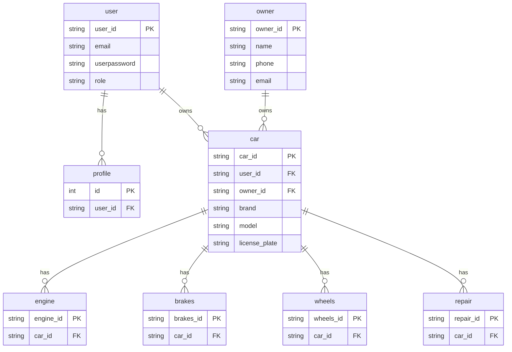

```mermaid
erDiagram

    user ||--o{ profile : has
    user ||--o{ car : owns

    owner ||--o{ car : owns

    car ||--o{ engine : has
    car ||--o{ brakes : has
    car ||--o{ wheels : has
    car ||--o{ repair : has

    user {
        string user_id PK
        string email
        string userpassword
        string role
    }

    profile {
        int id PK
        string user_id FK
    }

    owner {
        string owner_id PK
        string name
        string phone
        string email
    }

    car {
        string car_id PK
        string user_id FK
        string owner_id FK
        string brand
        string model
        string license_plate
    }

    engine {
        string engine_id PK
        string car_id FK
    }

    brakes {
        string brakes_id PK
        string car_id FK
    }

    wheels {
        string wheels_id PK
        string car_id FK
    }

    repair {
        string repair_id PK
        string car_id FK
    }
```
